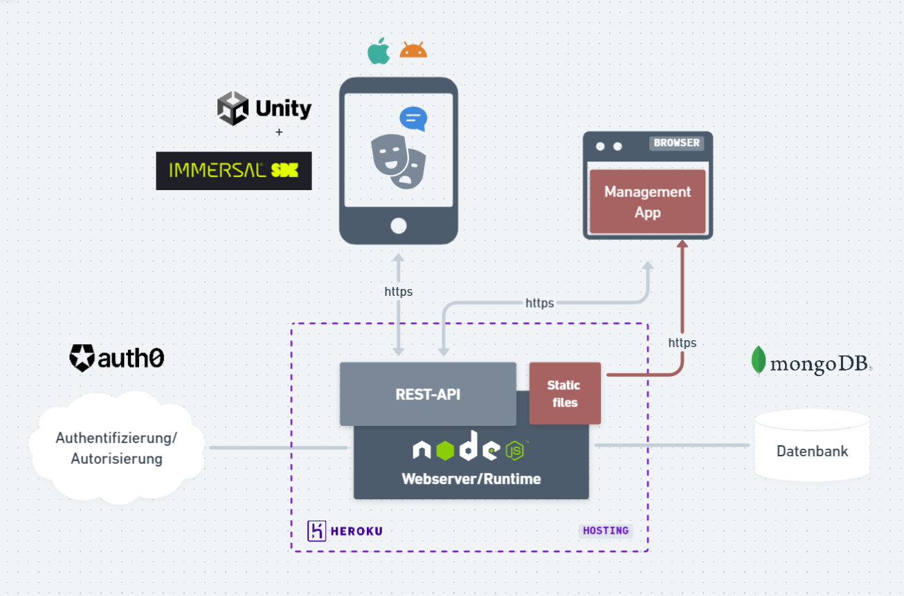
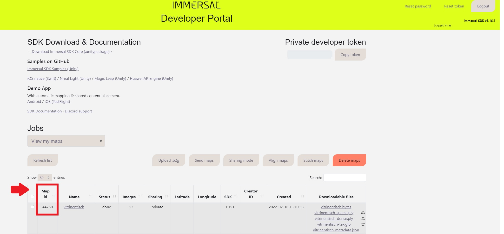
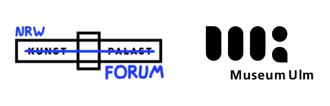
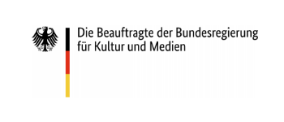

# ARt chat - Objekttexte in Augmented Reality

Mit ARt chat können Museumsbesucher*innen virtuell Objekttexte in der Ausstellung ergänzen und mit anderen diskutieren. Die App verbindet Augmented Reality, Kunst und Kommunikation.

Objekttexte werden oft intensiver betrachtet als das tatsächliche Werk. Und wer sagt eigentlich, dass die dort geschriebene Interpretation, die einzig mögliche ist?

Wir wollen die Autor*innenschaft von Ausstellungstexten hinterfragen und erweitern. Die App ARt chat bietet die Möglichkeit eigene Beiträge virtuell beizutragen oder andere Texte zu kommentieren. So kann ein Austausch zwischen den Betrachtenden stattfinden finden und es können sich lebendige Diskussionen entwickeln.

## Entstehungskontext
ARt chat wurde gemeinsam von [nextmuseum.io](https://nextmuseum.io) und dem [MIREVI Lab](https://mirevi.de) der [Hochschule Düsseldorf](https://medien.hs-duesseldorf.de) entwickelt und mit [vobe.digital](https://vobe.digital) veröffentlicht. nextmuseum.io ist eine digitale Community Plattform für Schwarmkuration und Co-Kreation, initiiert vom [NRW-Forum](https://www.nrw-forum.de)/[Kunstpalast Düsseldorf](https://www.kunstpalast.de) und dem [Museum Ulm](https://museumulm.de). Gefördert von der Kulturstiftung des Bundes im Fonds Digital im Programm Kultur Digital sowie von der Beauftragten der Bundesregierung für Kultur und Medien.

# 📱 Installation der ARt chat App 
Zur Benutzung werden Smartphones oder Tablets benötigt, die entweder über ein iOS oder ein Android Betriebssystem verfügen. Die Anwendung läuft ab folgenden Betriebssystemen: Android ab *(Version 8.X)*, iOS *(ab Version 12.X)* zusätzlich muss das Gerät ARCore oder ARKit fähig sein. Die App ist ca. 125 MB groß und es wird empfohlen, diese vorab im WLAN herunterzuladen. 

➡️ [Apple App Store](https://apps.apple.com/de/app/artchat/id1594639117) 
➡️ [Google Play Store](https://play.google.com/store/apps/details?id=de.nextmuseum.io.ARtchat). 
 
 
 
# 🛠️ Infos Für Entwickler innen
## Übersicht der Komponenten
Dieses Repository gibt Informationen zur Zusammensetzung der Teile der App inkl. Backend. Da die Applikation auf mehrere Teile basiert, wird hier ein Überblick hergestellt.

## Immersal - Mapping App
Eine App um Kunstwerke einzuscannen um diese mit der DB und dem QR Code zu verknüpfen. 
➡️ [Immersal Mapper - Apple App Store](https://apps.apple.com/app/immersal-mapper/id1466607906) 
➡️ [Immersal Mapper - Google Play Store](https://play.google.com/store/apps/details?id=de.nextmuseum.io.ARtchat). 
 

### QR Codes generieren
Einen QR Code generieren aus der ID des gescannten Kunstwerke(Maps).
Zum Beispiel über die Website: https://qr1.at/#text
 
Die "Map id" findest du auf https://developers.immersal.com

## Unity Immersal SDK
Wird benötigt um auf gescannte Kunstwerke(Maps) aus der Immersal Online Datenbank via ID gerunterzuladen.
SDK herunterladen und in das Projekt integrieren. 
🆔 Registrierung erforderlich. 
https://developers.immersal.com 

## MongoDB 
NoSQL Datenbank. Wird zur Speicherung von Daten über die Ausstellung, die Kunstwerke, die Benutzer*innen und dem Chat verwendet. 
Für ARt chat wurde bspw. das Cloud-Angebot **MongoDB Atlas** des MongoDB-Entwicklers verwendet. 
⚙️ Datenspeicher 
🆔 Registrierung erforderlich. 
https://www.mongodb.com/de-de/atlas 

## Auth0

Auth0 ist eine einfach zu implementierende, anpassungsfähige Authentifizierungs- und Autorisierungsplattform. Auth0 übernimmt alle Logins über Email oder Social Media. Um sich über **Social Logins** wie Google, Apple oder Facebook einloggen zu können sind weiter Einstellungen notwendig, die alle innerhalb der Auth0 Dokumnetation beschrieben werden.
 
⚙️ Authentifizierung/Autorisierung, Social Logins 
🆔 Registrierung erforderlich. 
https://auth0.com/de 

## Heroku
Wird verwendet, um die REST-API sowie Management App laufen zu lassen. 
⚙️ Hosting/Betrieb der Webkomponenten 
🆔 Registrierung erforderlich. 
https://www.heroku.com 

## Unity
Entwicklungsumgebung für dieses Repository. 
Wird zum kompilieren der App verwendet. 
Version: 2020.3.20 
[Unity download archive](https://unity3d.com/get-unity/download/archive) 
Die Build Plattform iOS oder Android sollte ebenfalls installiert werden.

# 🛠️ Unity Doku & Server Schnittstelle
1. [Android/iOS Apps: Unity](./docs/unity-development.md)
2. [REST-API + Management App: Web](./docs/web-development.md)
 
 
 

# Credits 
Auftraggeber*in/Rechteinhaber*in : Stiftung Museum Kunstpalast 
 
Ein Projekt von 
 
 
 
Gefördert im Programm
 
 
 
Gefördert von
 
 

Urheber*innen: Stiftung Museum Kunstpalast, nextmuseum.io
Code und Dokumentation in diesem Repositorium wurden begutachtet und erweitert durch [vobe.digital](vobe.digital)

# Markenname 
„ARt Chat“ ist eine Marke der Stiftung Museum Kunstpalast. Die Marke kann von anderen gemeinnützigen Körperschaften für Software genutzt werden, die auf dem veröffentlichten Code (Repositorium) basiert. In diesem Fall wird um Angabe des folgenden Nachweises gebeten:
 
 

# Lizenz
Herausgeber: Stiftung Museum Kunstpalast 
Ehrenhof 4-5  
40479 Düsseldorf 
Tel. +49 (0) 211-566 42 100  
Fax. +49 (0) 211-566 42 906 
https://www.kunstpalast.de/ 
 
in Kooperation mit 
 
Stadt Ulm – Museum Ulm  
Marktplatz 9 
89073 Ulm 
Tel. +49 (0) 731-161 4301 
https://museumulm.de/ 
 
 

