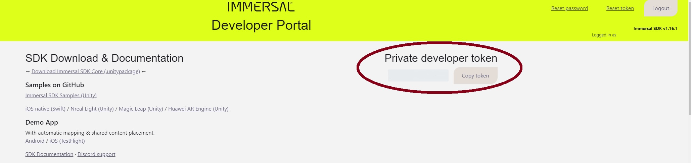
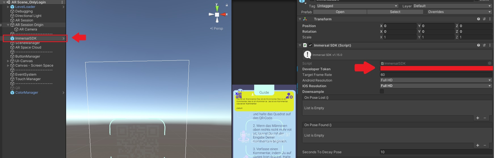

# Unity Entwicklung: iOS/Android App

## Entwicklungsumgebung einrichten

> ⚠️ Der folgende Abschnitt setzt voraus, dass die Registrierung  aller erforderlicher Accounts erfolgreich abgeschlossen wurde.

### Installieren von Unity

Die verwendete Unity Version beim Erstellen der ArtChat Anwendung ist 2020.3.20. Diese muss auf der offiziellen Seite entweder über das [Archiv](https://unity3d.com/get-unity/download/archive) oder über den [Unity Hub](https://unity.com/download) heruntergeladen werden. In der Regel ist es kein Problem eine neuere Version aus der Reihe zu installieren (2020.3.20+). Beim Installieren gilt es zu beachten, dass für iOS und Android Builds die jeweiligen Module dafür ausgewählt werden.

### Verknüpfung von Immersal

Um Immersal mit Unity zu verbinden wird ein Developer Token benötigt. Dieser kann nach erfolgreichem Login auf der offizielen [Seite von Immersal für Entwickler*innen](https://developers.immersal.com/) rechts oben unter "Private developer token" gefunden werden.

Dieser Token wird im Unity Projekt in der Szene **AR Scene_OnlyLogin**, welche im Projekt unter Assets>Scenes>AR Scene_OnlyLogin zu finden ist, wie im Bild dargestellt eingegeben.

### Verknüpfung vom Heroku Server

Im Projekt kümmert sich die APIManager.cs Klasse um die Netzwerkverbindungen von und zu Heroku. Diese Klasse ist zu finden unter Assets>Scripts>APIManager.cs. Hier muss in der Kopfzeile der String **baseURL** auf die URL des neuen Heroku Servers angepasst werden.

#### Social Logins

Um sich mithilfe von Google, Apple oder Facebook einloggen zu können sind weiter Einstellungen notwendig, die alle innerhalb der Auth0 Dokumentation beschrieben werden.

### Unity Plugins

- Für den AR-Teil der Anwendung wird auf ARFoundation zurückgegriffen. Hierfür muss in Unity über den Package Manager [ARFoundation](https://docs.unity3d.com/Packages/com.unity.xr.arfoundation@4.1/manual/index.html) (4.1.7+), [ARCore XR Plugin](https://docs.unity3d.com/Packages/com.unity.xr.arcore@4.1/manual/index.html) (4.1.7+) und das [ARKit XR Plugin](https://docs.unity3d.com/Packages/com.unity.xr.arkit@4.1/manual/index.html) (4.1.7+) installiert werden. Es empfiehlt sich bei den drei Plugins immer die selbe Versionsnummer zu benutzen.
- Für die Benachrichtigung bei neuen Kommentaren haben wir auf das Unity Plugin [Mobile Notifications](https://docs.unity3d.com/Packages/com.unity.xr.arkit@4.1/manual/index.html) (1.4.3+) zurückgegriffen.
- Um Deeplinling für iOS App Store Konform zu ermöglichen mussten wir zusätzlich auf das Plugin [UniWebView](https://docs-v3.uniwebview.com/guide/)(v3.18) zurückgreifen. Mittlerweile gibt es nurnoch Version 4 im Asset Store zu kaufen. Die Umstellung ist nicht zu kompliziert und muss nur im **DeepLinkManager.cs**, zu finden unter Assets>Scripts>Managers>DeepLinkManager.cs erfolgen.
- Für kleinere Helper Klassen innerhalb der Netzwerkaufrufe wurde auf das kostenlose Plugin [RestClient](https://assetstore.unity.com/packages/tools/network/rest-client-for-unity-102501) zurückgegriffen.
- Vollständigkeitshalber: Für die Erkennung von Immersal wurde ebenfalls deren Plugin [Immersal SDK](https://github.com/immersal/immersal-sdk-samples) installiert.
